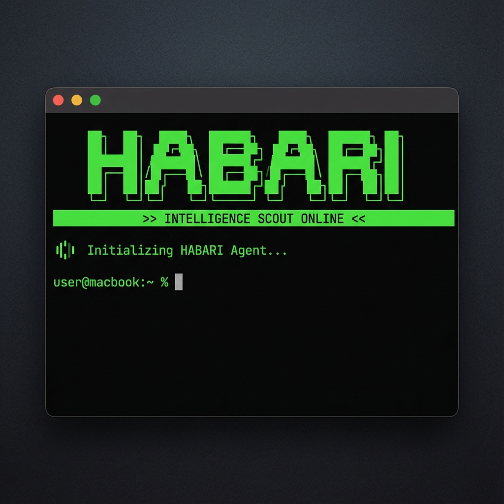

# HABARI: The AI Intelligence Scout



Daily AI/ML news digest for developers. Pulls from arXiv and Hacker News, filters for relevance, dedupes, and summarizes with Gemini.

## Setup

1. **Install Rust**: Ensure you have the Rust toolchain installed ([rustup.rs](https://rustup.rs)).
2. **Environment**: Create a `.env` file in the root directory:
   ```env
   GEMINI_API_KEY=your-key
   ```

## Usage

```bash
### Running the system
`cargo run`
```

## Automation with GitHub Actions

This project is configured to run automatically every day at 13:00 UTC (08:00 ET) via GitHub Actions. It will:
1.  Fetch and analyze the latest AI news.
2.  Send a premium HTML digest to your email.
3.  Archive raw data and update its internal "seen" database.
4.  Commit and push changes back to the repository.

### Setup GitHub Secrets
To enable automation, go to your repository **Settings > Secrets and variables > Actions** and add:
- `GEMINI_API_KEY`: Your Google Gemini API Key.
- `RESEND_API_KEY`: Your Resend API Key.
- `DESTINATION_EMAIL`: The email address where you want to receive the digest.

# Build optimized release binary
cargo build --release
./target/release/ai-news-curator-rust

## How it works

1. Fetches latest papers from arXiv (cs.AI, cs.LG, cs.CL, cs.MA)
2. Fetches top HN posts filtered by AI keywords concurrently
3. Dedupes against SQLite store of seen items
4. Gemini summarizes the top 15 items into a scannable digest
5. Marks items as seen to avoid repeats

Data stored in `seen_items.db` (auto-created).
